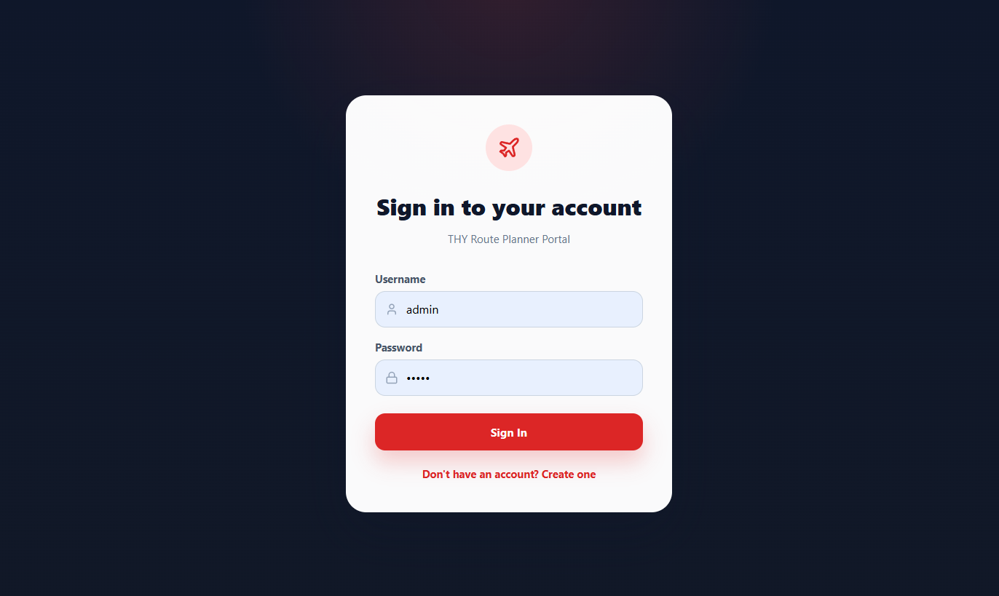
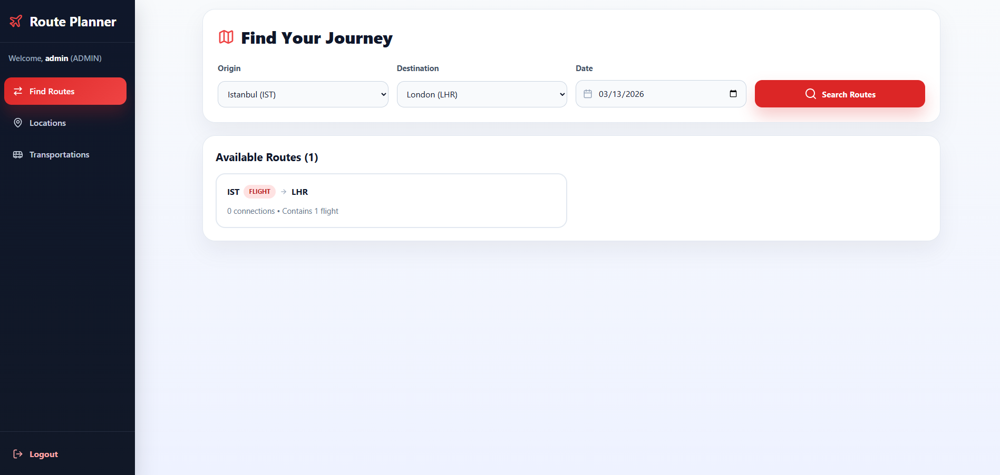
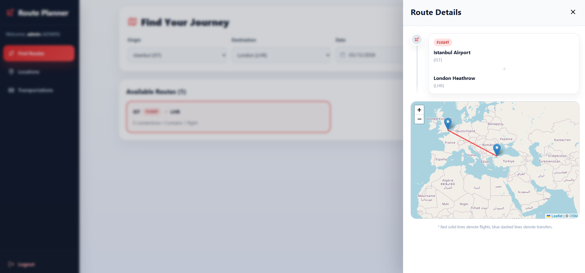

# THY Route Planner

A full-stack case study for route planning and transportation management in the aviation domain.

This project includes:
- a Spring Boot REST API for authentication, locations, transportations, and route search
- a React + Vite SPA for admin management and route discovery

## Features

- Route search with up to 3 legs and exactly 1 flight
- Role-based access with `ADMIN` and `AGENCY`
- Admin CRUD screens for locations and transportations
- Route detail side panel with map visualization
- JWT authentication
- Liquibase database migrations
- Redis cache support
- Swagger / OpenAPI documentation

## Tech Stack

### Backend
- Java 17
- Spring Boot 3
- Spring Security
- Spring Data JPA / Hibernate
- PostgreSQL
- Redis
- Liquibase
- MapStruct

### Frontend
- React 19
- Vite
- TypeScript
- React Router
- React Leaflet
- CSS Modules
- Lucide React

## Run Locally

### Prerequisites
- Docker and Docker Compose
- Node.js and npm

### 1. Start backend services

From the repository root:

```bash
docker compose up -d --build
```

Available URLs:
- Backend API: `http://localhost:8080/api`
- Swagger UI: `http://localhost:8080/swagger-ui.html`

Notes:
- PostgreSQL, Redis, and the Spring Boot app run with Docker Compose
- Liquibase creates and migrates the schema automatically

### 2. Start frontend

In a separate terminal:

```bash
cd frontend
npm install
npm run dev -- --host 0.0.0.0
```

Frontend URL:
- `http://localhost:5173`

## Default Credentials

Pre-seeded admin user:
- Username: `admin`
- Password: `admin`

You can also register a new user from the login screen. New registrations are created with the `AGENCY` role.

## Authorization Rules

- `ADMIN` can access all endpoints and all frontend screens
- `AGENCY` can only access route listing
- If an agency calls location or transportation endpoints, backend returns `403`
- If authentication is missing, backend returns `401`

## Example Route Search

Seeded sample locations:
- Istanbul Airport (`IST`)
- Taksim Square (`TAK`)
- London Heathrow (`LHR`)
- Wembley Stadium (`WEM`)

Example scenario:
1. Log in to the frontend
2. Open `Routes`
3. Select origin `Taksim Square`
4. Select destination `Wembley Stadium`
5. Choose a Monday, Wednesday, or Friday date
6. Inspect the returned route and side-panel map details

## Swagger

Swagger UI is reachable without authentication at:

```text
http://localhost:8080/swagger-ui.html
```

You can authorize with a JWT from the login endpoint to test protected APIs.

## Screenshots

### Login



### Routes



### Route Detail



## Notes

- Swagger is public by design for the case study requirement that it must be reachable
- The frontend currently uses CSS Modules, not Tailwind
